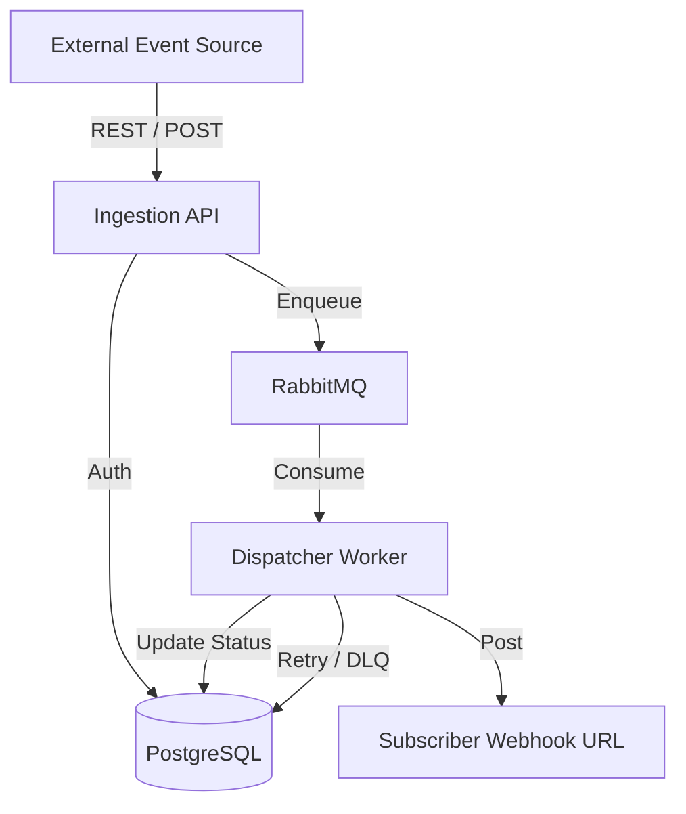

# 🏗 System Architecture

The Webhook Delivery Platform is designed for high reliability, decoupling event ingestion from delivery processing using a message queue.

## 📡 Data Flow
1. **Ingestion**: An external system sends an event to the `/api/v1/events` endpoint. 
2. **Security**: The API verifies the user's API Key and calculates an HMAC-SHA256 signature for the payload.
3. **Queueing**: The event is pushed into a RabbitMQ queue (`webhook_deliveries`).
4. **Processing**: The Dispatcher Worker consumes messages from the queue.
5. **Delivery**: The worker attempts a POST request to the subscriber's URL, including the HMAC signature in the headers.
6. **Retries**: If the destination is down, the worker implements an exponential backoff retry strategy.
7. **DLQ**: After 5 failed attempts, the delivery is moved to the Dead Letter Queue for manual inspection.

## 💾 Component Diagram

## 🔒 Security Model
*   **API Key Auth**: All management and ingestion requests require a Bearer token.
*   **HMAC Signing**: All dispatched webhooks include `X-Webhook-Signature`.
*   **Payload Verification**: Consumers can replicate the HMAC calculation using their shared secret key to verify the payload hasn't been tampered with.
